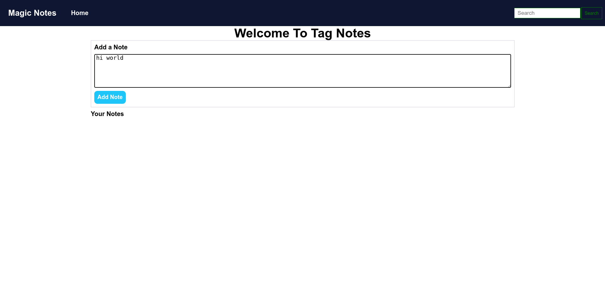
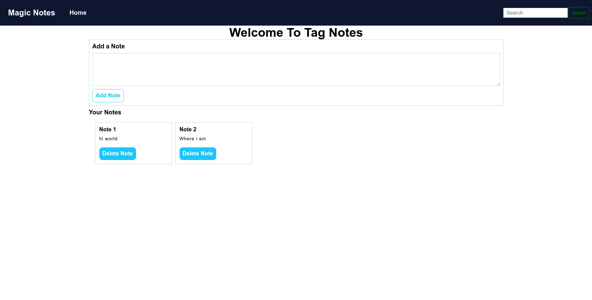
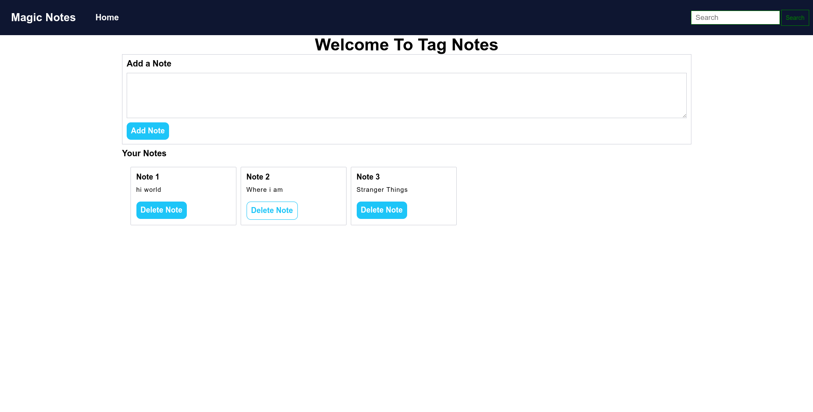
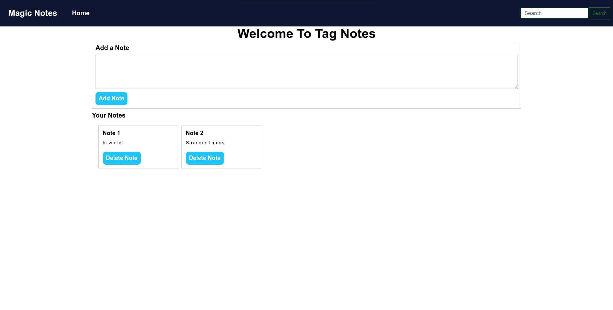
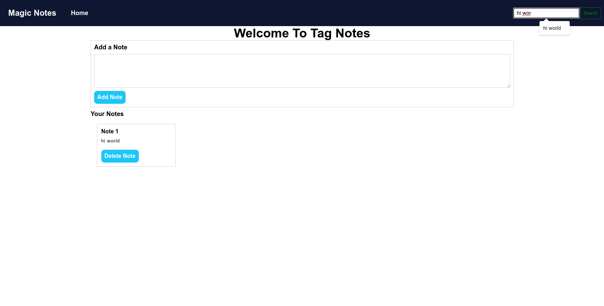

# Add_notes and Delete Notes

-> This web app is usefull to create sort notes of your tasks.
 
-> You can easly organize all day activity through this app and track your tasks.
 
-> Also you are able to add,delete,serach Your notes.
 
-> I used LocalStorage for storing its data temporarily in local cache.
 
-> I used linear Search for searching string data from existing notes and able to find Notes.
 
-> In this site i used pure HTML CSS JS.
 
 
Creating Note

 
Add Note

 
Delete Notes

 
Deleted Notes

 
Search Notes

