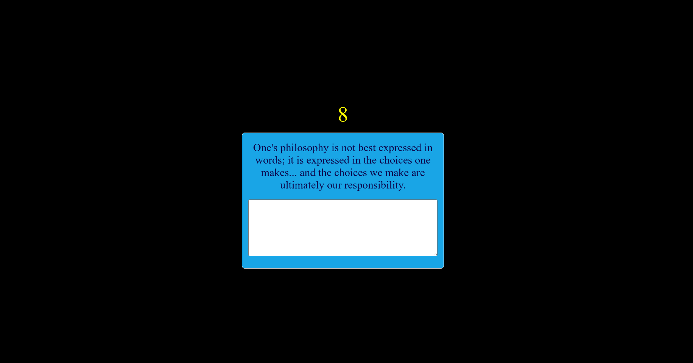
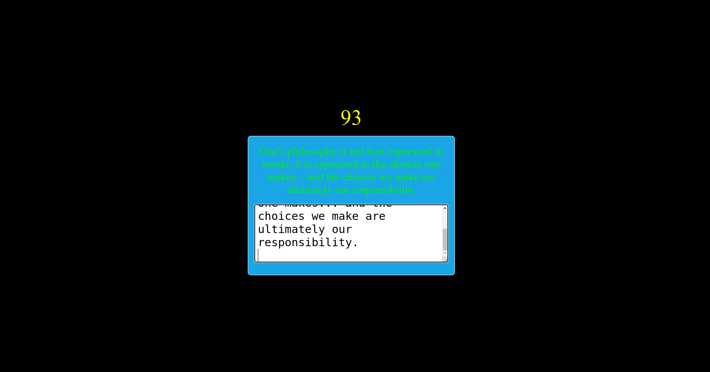
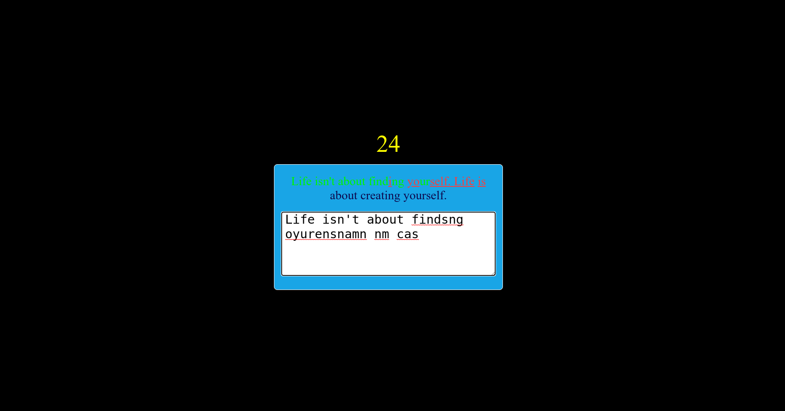

# Speed_Type
-> This is speedType prompt where people can practice and enhance thier writing on keyboard.
-> I used Quotes API to call Quotes.
-> Used Async Await because of Fetch API takes Some time to Fetch the information from the site.
-> Matching String to Quotes if Quotes and your input matches text will convert into green.
-> If text not matching with Quotes it wiil convet into red text.

demo=>1

demo=>2

demo=>3

